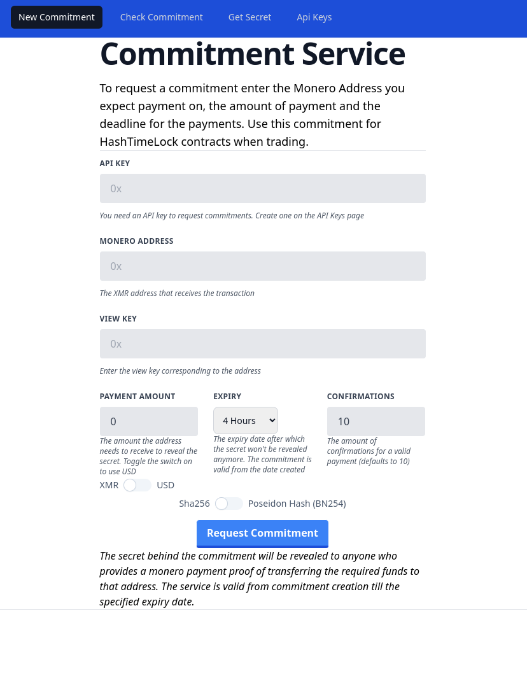

# Commitment Service - HTLC support for Monero Trading
WIP
Example UIs:




Example:


The Commitment Service aims to tackle a problem with Monero Atomic Swaps, they are difficult to develop.

The Commitment Service is a secret provider infrastructure that provides secrets for Hash Time Lock Contracts, to use a simple commitment-reveal scheme while trading monero.

The HTLC contracts can be deployed on Bitcoin, Litecoin, Ethereum, Solana or any chain that can support it.

Monero doesn't have smart contracts and developing multisig is complex and requires the users to download a specialized wallet and complex messaging.

Instead of that, the Commitment Service is a (decentralizable) third party that verifies Monero transactions and reveals secrets in-exchange.

The Commitment Service:

1. Never has access to any funds
2. Never knows where the commitments and secrets are actually used
3. Can't be used to steal funds by third party, if the database is hacked.
4. It's not an escrow and doesn't provide dispute resolution
5. It's more similar to an Oracle that checks Monero payments and reveals secrets to specific users.
6. Discards the monero payment proofs after the secret is revealed.

The Commitment Service reveals the pre-image of a commitment to a user that can provide a valid proof of monero transaction. Payment proofs are checked using `check_tx_key TXID TXKEY ADDRESS`

### Example Flow
```
* Alice wants to exchange her XMR to Sol with Bob.
* Alice sends Bob her Sol address and they agree on the exchange rate
* Bob contacts the Commitment Service and requests a Commitment, When requesting the commitment Bob configures the Commitment Service to reveal the secret of the commitment for a payment proof of X amount made to his address
* Bob interacts with a smart contract on Solana and deposits the Sol to trade with the commitment and Alice's address
* The HTLC on Solana unlocks the Sol if the secret is provided by Alice else it refunds it in 1 day back to Bob
* Alice makes the XMR deposit to Bobs address
* Alice then creates a payment proof and uses it to get the secret from the Commitment Service 
* Alice then pulls payments from the Smart contract using the secret
```


The explained flow works on every smart contract chain and Solana was just an example.

### Benefits
1. The Commitment Service offers a simple flow for trading
2. It's more easy to develop for than a Multisig Escrow
3. Trading is always P2P, Alice transfers directly to Bob, then Bob transfer to Alice via Smart Contract
4. No local app to run for users. No local cli apps needed to swap
5. It works in the browser and uses existing monero wallet


### Considerations
* The users need to have 2 browser windows open. One to use the Commitment Service's interface and one to do a swap with a browser wallet on chain
* It can however be used as a JSON API and embedded into applications/websites or served in an IFRAME
* It must stay online, else there can be loss of funds due to the HTLC timelock expiration, the biggest challenge for security is DDOS mitigation
* The Commitments can be used to query for the XMR address (only while the commitment is valid) so  the XMR addresses never need to be stored on smart contract chains this way

### Monetizing
The Commitment Service is a paid service that works with a `pay per commitment` model. Api billing is needed also to stop malicious users from requesting too many commitments.

Example: 
* Bob deposits XMR to the Commitment Service's address
* Bob uses the Proof of Deposit to get an API key from the Commitment Service
* API key has a quota
* Bob uses the API Key to create commitments at the provider and when he uses his quota he needs to get a new key
* Example fees could be: 1000 commitments per $0.1 worth of XMR 


### Decentralization
The Commitment Service infrastructure can be decentralized, however instead of building a complex network to decentralize it, a simpler approach should be used, it should work as a manual DAO.

* N amount of people can become Commitment Services
* They create an N of M multisig account via Monero CLI and communicate via chat
* The Commitment Services configure their instances to pay into the Multisig account
* At the end of the month, Commitment Services withdraw their profits from the multisig in consensus
* If a commitment service goes down and this results in loss of funds, reimbursement could be requested via chat
* A provider that goes down too often could be kicked out if it results in loss of funds

This would allow for a simple decentralization where humans are representing each instance and large networks of nodes don't exist. Having 4-5 providers are more than enough.

It would be also possible to implement decentralized sharing schemes for secrets via threshold homomorphic encryption which is up for research (golang latigo library can work for this, but I don't want to over complicate things)

## API

The API serves HTML without Javascript and there is a JSON API

//TODO: This is under development


## How commitments are computed

The commitment is a sha256 hash of a 32 byte secret buffer.
Poseidon hash is also available for ZKP.

The commitment and the secret can be converted string from to a buffer using using Javascript with this:

```
function decodeString(hexString) {
  return Buffer.from(hexString, 'hex');
}

// Encode a byte array to a hex string
function encodeToString(byteArray) {
  return Buffer.from(byteArray).toString('hex');
}

```

Following this will make sure you stay consistent with the Go implementation which uses `hex.EncodeToString` and `hex.DecodeString` and `sha256.Sum256` and `go-iden3-crypto` `poseidon`

The corresponding hash for the sha256 in javascript is:

`const hashBuffer = await crypto.subtle.digest("SHA-256", buff);`

So you can recreate the hash provided by the Commitment Service in Javascript easily. This should be compatible with all sha256 hashes provided by on-chain contracts too!

For using the poseidon hash, you can use circomlibjs poseidon hash and validate it inside a circom circuit for zkp


## Example Contract to use with the service
Here is an example Hash time lock contract in solidity that would be compatible with this

```
// SPDX-License-Identifier: MIT
pragma solidity ^0.8.0;

contract HTLC {
    address payable public sender;
    address payable public recipient;
    bytes32 public hashLock;
    uint256 public timeLock;
    bool public isClaimed;

    event Funded(uint256 amount);
    event Claimed(bytes32 secret);
    event Refunded();

    modifier onlySender() {
        require(msg.sender == sender, "Not the sender");
        _;
    }

    modifier onlyRecipient() {
        require(msg.sender == recipient, "Not the recipient");
        _;
    }

    constructor(
        address payable _recipient,
        bytes32 _hashLock,
        uint256 _timeLock
    ) payable {
        sender = payable(msg.sender);
        recipient = _recipient;
        hashLock = _hashLock;
        timeLock = block.timestamp + _timeLock;
        isClaimed = false;

        require(msg.value > 0, "No funds provided");
        emit Funded(msg.value);
    }

    function claim(bytes32 _secret) public onlyRecipient {
        require(sha256(abi.encodePacked(_secret)) == hashLock, "Invalid secret");
        require(block.timestamp < timeLock, "Time lock expired");
        require(!isClaimed, "Already claimed");

        isClaimed = true;
        recipient.transfer(address(this).balance);
        emit Claimed(_secret);
    }

    function refund() public onlySender {
        require(block.timestamp >= timeLock, "Time lock not expired");
        require(!isClaimed, "Already claimed");

        sender.transfer(address(this).balance);
        emit Refunded();
    }
}

```

## Using multisig wallet as deposit address

The commitment provider doesn't care what address is used for depositing same way it has now knowledge of where the commitment is used.
If an application developer implements Multisig for depositing, that can create applications where XMR could be refunded also.
A use-case that comes to mind is Monero Collateral Loans.

Let me explain:

```
Alice (borrower) wants to take a USDT load from Bob (lender) with 50% collateral, lets say on Ethereum

Alice gives her Eth address to Bob

Bob creates a 2-2 multisig address with a Liquidator service

Bob uses the multisig address to create a commitment at the commitment service

Bob deposits into an ethereum smart contract with Alice's address and the commitment

Now, Alice makes the deposit into the Multisig address, claims the secret and withdraws the loan

The XMR deposit stays in the multisig owned by the Liquidator and Bob. 

If the price of XMR falls under a threshold, the liquidator will sign a message to liquidate the XMR and send it to Bob

If Alice decides to pay back the loan with interest, first she creates a commitment at the commitment service
Alice deposits the payback amount using bob's address and the commitment, they will do a swap back.

Then the liquidator and Bob sign a transaction to transfer the XMR back, to an address provided by the commitment service.

When the XMR transaction is done, Bob uses the secret to claim back the money he lent out to Alice.
```